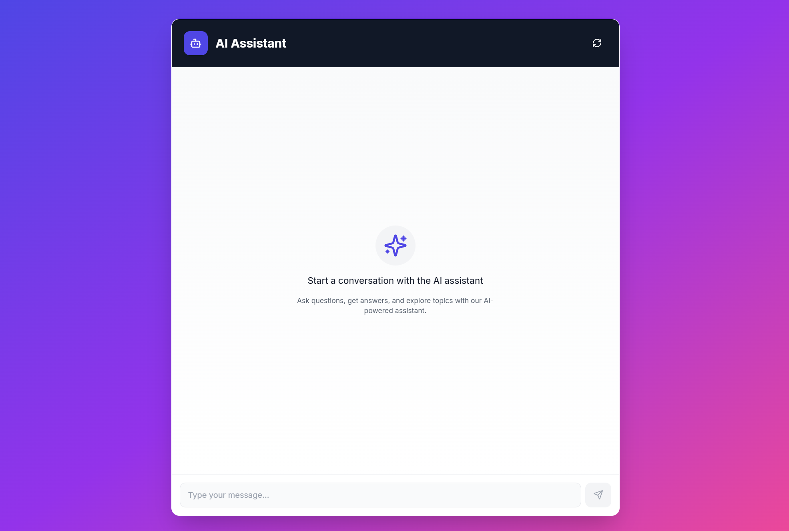

# AI Chat Application



[English version](#ai-chat-application-english-version)


Cette application est un chat interactif alimenté par l'intelligence artificielle, combinant un backend FastAPI avec un frontend React.


## Structure du projet

Le projet est divisé en deux parties principales :

- `backend/` : Contient le code du serveur FastAPI
- `frontend/` : Contient le code de l'interface utilisateur React

## Démarrage rapide

### Backend

1. Naviguez vers le dossier backend :
   ```
   cd backend
   ```
2. Installez les dépendances :
   ```
   pip install -r requirements.txt
   ```
3. Configurez votre clé API Hugging Face dans un fichier `.env`
4. Lancez le serveur :
   ```
   uvicorn app:app --reload
   ```

### Frontend

1. Naviguez vers le dossier frontend :
   ```
   cd frontend
   ```
2. Installez les dépendances :
   ```
   npm install
   ```
3. Lancez l'application :
   ```
   npm run dev
   ```

## Fonctionnalités

- Interface utilisateur réactive et moderne
- Génération de réponses AI en temps réel
- Historique des conversations

## Technologies utilisées

- Backend : FastAPI, Python
- Frontend : React, TypeScript, Vite
- Styles : Tailwind CSS

## Documentation détaillée

Pour plus d'informations sur chaque partie du projet, veuillez consulter les README respectifs :

- [Documentation du Backend](backend/README.md)
- [Documentation du Frontend](frontend/README.md)

## Contribution

Les contributions sont les bienvenues ! Veuillez consulter les guides de contribution dans les README du backend et du frontend pour plus de détails.

## Licence

Ce projet est sous licence MIT. Voir le fichier [LICENSE](LICENSE) pour plus de détails.


# AI Chat Application (English Version)


This application is an interactive chat powered by artificial intelligence, combining a FastAPI backend with a React frontend.

## Project Structure

The project is divided into two main parts:

- `backend/`: Contains the FastAPI server code
- `frontend/`: Contains the React user interface code

## Quick Start

### Backend

1. Navigate to the backend folder:
   ```
   cd backend
   ```
2. Install dependencies:
   ```
   pip install -r requirements.txt
   ```
3. Configure your Hugging Face API key in a `.env` file
4. Launch the server:
   ```
   uvicorn app:app --reload
   ```

### Frontend

1. Navigate to the frontend folder:
   ```
   cd frontend
   ```
2. Install dependencies:
   ```
   npm install
   ```
3. Launch the application:
   ```
   npm run dev
   ```

## Features

- Responsive and modern user interface
- Real-time AI response generation
- Conversation history

## Technologies Used

- Backend: FastAPI, Python
- Frontend: React, TypeScript, Vite
- Styles: Tailwind CSS

## Detailed Documentation

For more information on each part of the project, please consult the respective README files:

- [Backend Documentation](backend/README.md)
- [Frontend Documentation](frontend/README.md)

## Contribution

Contributions are welcome! Please refer to the contribution guides in the backend and frontend README files for more details.

## License

This project is under the MIT license. See the [LICENSE](LICENSE) file for more details.
